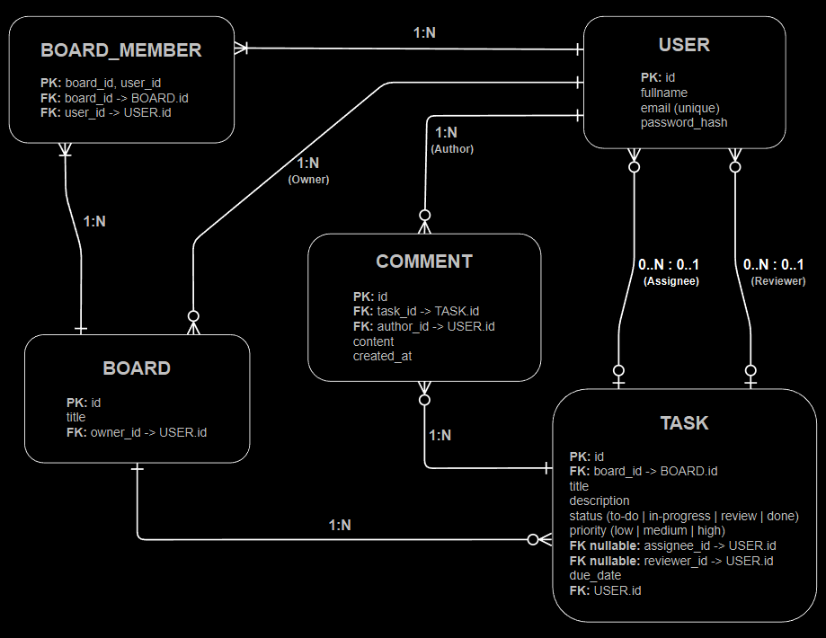

# KanMind Backend (Django REST Framework)

Backend API for the KanMind frontend (Vanilla JS).
Provides token-based authentication, boards, tasks, and task comments.

## Tech Stack

- Python

- Django

- Django REST Framework (DRF)

- DRF Token Authentication

- django-cors-headers

- SQLite (dev)

## Key Concepts

- Authentication via Authorization: Token <token>

- Users log in with email (no username) and have a fullname

- Board access/editing is controlled by board membership:

- If you are a member of a board, you can read/edit its tasks and comments.

## API Base URL

http://127.0.0.1:8000/api/

## Endpoints

### Auth

#### POST /api/registration/

- Request: fullname, email, password, repeated_password

- Response: token, user_id, email, fullname

#### POST /api/login/

- Request: email, password

- Response: token, user_id, email, fullname

### Users

#### GET /api/email-check/?email=<email>

- Auth required

- Response (200): id, email, fullname

- Response (404): user not found

### Boards

#### GET /api/boards/

- Auth required

- Returns boards where the current user is a member

#### POST /api/boards/

- Auth required

- Request: title (optional: members as list of user IDs)

##### Notes:

- created_by is set automatically to the current user

- creator is automatically added to members

#### GET /api/boards/<board_id>/

- Auth required (board member or creator)

#### PATCH /api/boards/<board_id>/

- Auth required (board member or creator)

- Can update title and/or set members (list of user IDs)

#### DELETE /api/boards/<board_id>/

- Auth required (board member or creator)

### Tasks

#### GET /api/tasks/

- Auth required

- Returns tasks from boards where the current user is a member

#### POST /api/tasks/

- Auth required

- Minimum request: board (board ID), title

- Optional: description, status, assigned_to, reviewer

##### Notes:

- created_by is set automatically to the current user

- Only board members can create tasks on that board

#### PATCH /api/tasks/<task_id>/

- Auth required (board member)

- Example fields: status, assigned_to, reviewer, title, description

#### DELETE /api/tasks/<task_id>/

- Auth required (board member)

#### GET /api/tasks/assigned-to-me/

- Auth required

- Returns tasks where assigned_to == current user

- Response is always a list (array)

#### GET /api/tasks/reviewing/

- Auth required

- Returns tasks where reviewer == current user

- Response is always a list (array)

### Comments

#### GET /api/tasks/<task_id>/comments/

- Auth required (board member)

- Returns a list of comments for that task

#### POST /api/tasks/<task_id>/comments/

- Auth required (board member)

- Request: text

##### Notes:

- author is set automatically to the current user

- task is taken from the URL

#### DELETE /api/tasks/<task_id>/comments/<comment_id>/

- Auth required (board member)

- Response: 204 No Content

## Data Model (Relations)

- User creates many Boards (1:n)

- Users are members of many Boards (m:n)

- Board has many Tasks (1:n)

- Task optionally has one assigned user and one reviewer (0..1:n)

- Task has many Comments (1:n)

- User writes many Comments (1:n)



## Project Structure

```text
kanmind_backend/
├─ core/                         Django project (settings, main urls, wsgi/asgi)
│  ├─ __init__.py
│  ├─ settings.py
│  ├─ urls.py
│  ├─ asgi.py
│  └─ wsgi.py
│
├─ auth_app/                      Authentication endpoints (login, registration)
│  ├─ migrations/
│  ├─ api/
│  │  ├─ __init__.py
│  │  ├─ serializers.py
│  │  ├─ views.py
│  │  ├─ urls.py
│  │  ├─ permissions.py
│  │  └─ validators.py            Validation helpers (API-level)
│  ├─ admin.py
│  ├─ apps.py
│  └─ models.py
│
├─ users_app/                     Custom user model + user lookup endpoint
│  ├─ migrations/
│  ├─ api/
│  │  ├─ __init__.py
│  │  ├─ views.py
│  │  ├─ urls.py
│  │  ├─ permissions.py
│  │  └─ validators.py            Validation helpers (API-level)
│  ├─ models.py
│  ├─ admin.py
│  └─ apps.py
│
├─ boards_app/                    Boards domain (board + members)
│  ├─ migrations/
│  ├─ api/
│  │  ├─ __init__.py
│  │  ├─ serializers.py
│  │  ├─ permissions.py
│  │  ├─ views.py
│  │  ├─ urls.py
│  │  └─ validators.py            Validation helpers (API-level)
│  ├─ models.py
│  ├─ admin.py
│  └─ apps.py
│
├─ tasks_app/                     Tasks + comments domain
│  ├─ migrations/
│  ├─ api/
│  │  ├─ __init__.py
│  │  ├─ serializers.py
│  │  ├─ permissions.py
│  │  ├─ views.py
│  │  ├─ urls.py
│  │  └─ validators.py            Validation helpers (API-level)
│  ├─ models.py
│  ├─ admin.py
│  └─ apps.py
│
├─ docs/                          Documentation assets
│  ├─ erd.drawio                  ER-diagram (drawio)
│  └─ erd.png                     ER-diagram (PNG)
│
├─ manage.py
├─ requirements.txt
├─ .gitignore
├─ .env                           Local secrets (not committed)
└─ .env.template                  Example environment variables (committed)
```

## Setup (Local Development)

### 1) Create and activate venv

Windows (PowerShell):

```text
python -m venv .venv

.\.venv\Scripts\Activate.ps1
```

macOS/Linux:

```text
python -m venv .venv

source .venv/bin/activate
```

### 2) Install dependencies

```text
pip install -r requirements.txt
```

If requirements.txt is not yet present:

```text
pip install django djangorestframework django-cors-headers

pip install python-dotenv

pip freeze > requirements.txt
```

### 3) Environment variables

Create a .env file (use .env.template as reference)

The project loads .env via python-dotenv in core/settings.py

DJANGO_SECRET_KEY=your-secret-key

##### Optional:

DEBUG=1

### 4) Run migrations

```text
python manage.py makemigrations

python manage.py migrate
```

### 5) Create admin user (optional)

```text
python manage.py createsuperuser
```

### 6) Start server

```text
python manage.py runserver
```

##### API will be available at:

http://127.0.0.1:8000/api/

##### Authentication Header (Example)

For all protected endpoints send:

Authorization: Token <your_token>

##### Notes

This project is intended for local development and learning.

Do not use the Django development server in production.

For production, use a proper WSGI/ASGI server and a production database.

##### License

Educational / internal project (adjust as needed).
